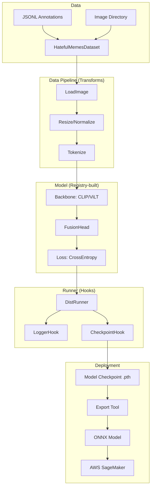

# Harmful Content Detection (HCD)

[](LICENSE)
[](https://www.python.org/)
[](https://pytorch.org/)

**Harmful Content Detection** is a modular, registry-driven framework for multimodal harmful content detection, designed to identify hate speech in memes using state-of-the-art Vision-Language models like CLIP and ViLT.

It employs a modular architecture inspired by modern computer vision frameworks, featuring a flexible config system, registry-based component management, and distributed training capabilities.

## 📄 Documentation

Detailed documentation is available in the `docs/` directory:
- [Training Guide](docs/train.md)
- [Evaluation Guide](docs/evaluate.md)
- [Inference Guide](docs/infer.md)
- [Export Guide](docs/export.md)
- [Deployment Guide](docs/deploy.md)
- [Distributed Training](docs/distributed_training.md)

## 🚀 News

- **[2026-01-07]** Initial release of HCD pipeline with CLIP/ViLT support, distributed training, and SageMaker deployment tools.

## 📖 Introduction

HCD provides a unified toolbox for training, evaluating, and deploying harmful content detection models.

### Major Features

- **Modular Design**: Decompose models into backbones, heads, and losses. Easily swap components via config.
- **Config-Driven**: Manage experiments with hierarchical configuration files.
- **Distributed Training**: Seamless multi-GPU support.
- **Production Ready**: Built-in ONNX export and AWS SageMaker deployment scripts.

## 🏗️ Pipeline Overview

The HCD framework implements a modular pipeline designed for flexibility and scalability:



1.  **Data Ingestion**: The `HatefulMemesDataset` loads image-text pairs and annotations from JSONL files.
2.  **Transformation**: A pipeline of transforms (e.g., `LoadImage`, `Tokenize`, `Resize`) prepares the raw data for the model.
3.  **Model Architecture**:
    *   **Backbone**: Pre-trained V&L models (e.g., CLIP) extract multimodal features.
    *   **Head**: A fusion head (e.g., `FusionHead`) combines features and predicts the probability of hate speech.
4.  **Training Loop**: The `DistRunner` orchestrates the training process, handling distributed communication, gradient updates via the `Optimizer`, and logging via hooks.
5.  **Export & Deployment**: Trained models are exported to ONNX format and packaged for deployment on AWS SageMaker.

## 📂 Code Structure

```text
harmful_content_detection/
├── configs/                 # Experiment configurations
├── data/                    # Dataset directory
├── deploy_aws/              # AWS deployment artifacts
├── docs/                    # Documentation
├── scripts/                 # Execution scripts (Entry points)
├── src/                     # Source code
│   ├── core/                # Core engine (Runner, Hooks, Registry)
│   ├── datasets/            # Dataset definitions and transforms
│   ├── models/              # Model components (Backbones, Heads, Losses)
│   ├── optimizer/           # Optimizer builders
│   └── utils/               # Utilities (Config, Logger)
├── tests/                   # Unit and integration tests
├── tools/                   # Underlying CLI tools
└── work_dirs/               # Training outputs (Logs, Checkpoints)
```

## 🛠️ Installation

### Prerequisites

- Linux or macOS
- Python 3.9+
- PyTorch 2.0+
- CUDA 11.3+ (for GPU training)

### Steps

1. **Clone the repository:**
   ```bash
   git clone https://github.com/christianlee-pku/harmful_content_detection.git
   cd harmful_content_detection
   ```

2. **Create a virtual environment (optional but recommended):**
   ```bash
   python -m venv venv
   source venv/bin/activate
   ```

3. **Install dependencies:**
   ```bash
   pip install -r requirements/runtime.txt
   ```

4. **Install the package:**
   ```bash
   pip install -e .
   ```

## 📂 Data Preparation

Please refer to the [Hateful Memes Challenge](https://ai.facebook.com/tools/hateful-memes/) for dataset access.

**Directory Structure:**
```text
data/
└── hateful_memes/
    ├── img/
    │   ├── 01235.png
    │   └── ...
    ├── train.jsonl
    ├── dev_seen.jsonl
    └── test_seen.jsonl
```

## ⚡ Getting Started

### Training

Train a CLIP-based model:

```bash
bash scripts/01_train.sh
```

### Evaluation

Evaluate the model on the validation set:

```bash
bash scripts/02_evaluate.sh
```

### Inference

Run inference on a single example:

```bash
bash scripts/03_infer.sh
```

## 🚀 Deployment

### Export to ONNX

```bash
bash scripts/04_export.sh
```

### Deploy to SageMaker

```bash
bash scripts/05_deploy.sh <ROLE_ARN>
```


## 🖊️ Citation

If you use this project in your research, please cite:

```bibtex
@misc{hcd2025,
  title={Harmful Content Detection Pipeline},
  author={Christian Lee},
  year={2025}
}
```

## 🎫 License

This project is released under the [Apache 2.0 license](LICENSE).
